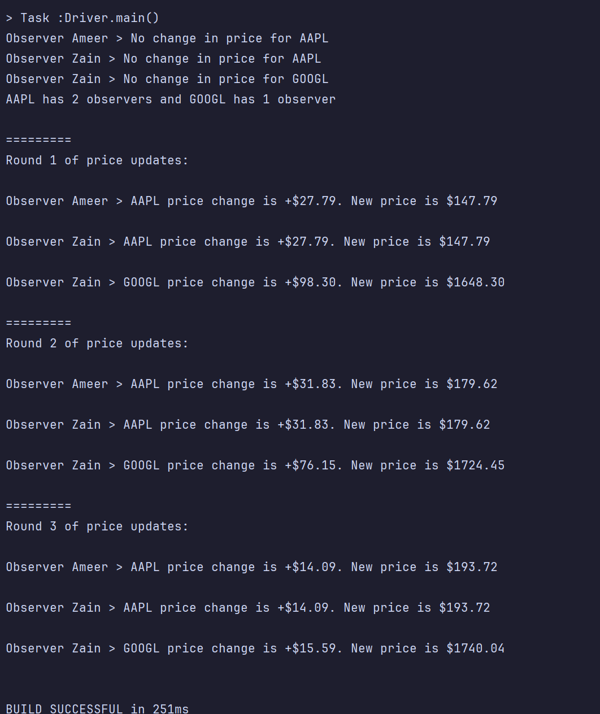

= Class Reference
:toc:

PDF generated using Asciidoctor PDF
GitHub Repository: https://github.com/ameerabdallah/CS-5800-Quiz-6

== Code

=== Observer.java

[source,java]
----
include::src/main/java/Observer.java[]
----

=== ObserverImpl.java

[source,java]
----
include::src/main/java/ObserverImpl.java[]
----

=== Stock.java

[source,java]
----
include::src/main/java/Stock.java[]
----

=== Driver.java

[source,java]
----
include::src/main/java/Driver.java[]
----

=== Output

